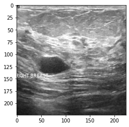
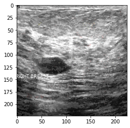

# CS 504 Final Project (Fall 2021) - Transferability attack
## Introduction
Course Webpage: [CS 404/504 Adversarial Machine Learning (Fall 2021)](https://www.webpages.uidaho.edu/vakanski/CS_504.html)

For this final project, I aim to create the transferability attack of adversarial examples across different machine learning models. I separate this project into three parts: 
- The first part: create several adversarial attacks on a Deep Neural Network model and transferring adversarial examples to Machine learning models.
- The second part: create several adversarial attacks on Machine learning models and transferring adversarial examples to Deep Neural Network models.
- The third part: create several adversarial attacks on a Deep Neural Network model and transferring adversarial examples to another Deep Neural Network model.

The purpose is to find the robustness of different machine learning models by transferring adversarial examples between the machine learning model and the deep learning model.
## Prerequisites
- Python3 (3.7)
- TensorFlow/Keras (2.7.0)
- Scikit-learn (1.0.1)
- Numpy (1.19.5)
- Matplotlib (3.2.2)
- OpenCV (4.1.2)
- [Adversarial Robustness Toolbox (ART)](https://github.com/Trusted-AI/adversarial-robustness-toolbox) (1.8.1)
## Setup
Open Git Bash ([Download Git SCM](https://git-scm.com/downloads)) and download repository by following command:

`$ git clone https://github.com/Silence-JL/CS-504-Final-Project-Fall-2021.git`

You can either use your local machine or [Google Colab](https://colab.research.google.com/?utm_source=scs-index) to run the notebooks. Change the dataset directory based on the comment in each notebook.
There are three folders in this repository:
- `../attack` contains all attack experiments for this final project
- `../img` contains one adversarial example of each notebook in  `../attack`.
- `../model` contains trained ResNet50 and MobileNet. Before using notebooks in `../attack`, make sure to train ResNet50 and MobileNet and save the model.

## Dataset
For this project, I used Breast Ultrasound Images Dataset (BUSI). This dataset consists of 780 images with three different classes: normal, benign and malignant. In this project, I will not consider using the mask images in the dataset. You can [Download](https://scholar.cu.edu.eg/?q=afahmy/pages/dataset) the BUSI dataset. If you need a detailed description of the dataset, you can find it in the [Related Paper](https://github.com/Silence-JL/CS-504-Final-Project-Fall-2021#related-paper).

## Methods and Models
### Attack Methods:
I used four attack models: PGD, FGSM, Deepfool and Boundary Attack. All attack methods are implemented by using [ART library](https://adversarial-robustness-toolbox.readthedocs.io/en/latest/). More details about each attack method can be find in `art.attacks.evasion` modules.
### Model Selection
I used two deep learning models from [Keras](https://keras.io/api/applications/): ResNet50 and MobileNet.

I used the following machine learning models in [Sklearn](https://scikit-learn.org/stable/): K Nearest Neighbors, Decision Trees, Logistic Regression, Support Vector Machines, Naïve Bayes, Bagging Classifier, Random Forest, Extra Trees and Gradient Boosting.
## Codes
### Transferability attack on ResNet50 to Machine learning models and MobileNet:
- BUSI_resnet50_PGD.ipynb [[nbviewer](https://nbviewer.org/github/Silence-JL/CS-504-Final-Project-Fall-2021/blob/main/attack/BUSI_resnet50_PGD.ipynb)]
- BUSI_resnet50_FGSM.ipynb [[nbviewer](https://nbviewer.org/github/Silence-JL/CS-504-Final-Project-Fall-2021/blob/main/attack/BUSI_resnet50_FGSM.ipynb)]
- BUSI_resnet50_Deepfool.ipynb [[nbviewer](https://nbviewer.org/github/Silence-JL/CS-504-Final-Project-Fall-2021/blob/main/attack/BUSI_resnet50_Deepfool.ipynb)]
- BUSI_resnet50_Boundary_Attack.ipynb [[nbviewer](https://nbviewer.org/github/Silence-JL/CS-504-Final-Project-Fall-2021/blob/main/attack/BUSI_resnet50_Boundary_Attack.ipynb)]
### Transferability attack on Logistic Regression to Machine learning model and Deep Neural Network:
- BUSI_LR_PGD.ipynb [[nbviewer](https://nbviewer.org/github/Silence-JL/CS-504-Final-Project-Fall-2021/blob/main/attack/BUSI_LR_PGD.ipynb)]
- BUSI_LR_FGSM.ipynb [[nbviewer](https://nbviewer.org/github/Silence-JL/CS-504-Final-Project-Fall-2021/blob/main/attack/BUSI_LR_FGSM.ipynb)]
- BUSI_LR_Deepfool.ipynb [[nbviewer](https://nbviewer.org/github/Silence-JL/CS-504-Final-Project-Fall-2021/blob/main/attack/BUSI_LR_Deepfool.ipynb)]
- BUSI_LR_Boundary_Attack.ipynb [[nbviewer](https://nbviewer.org/github/Silence-JL/CS-504-Final-Project-Fall-2021/blob/main/attack/BUSI_LR_Boundary_Attack.ipynb)]

All code is running under Google Colab GPU.
- There is a notebook shows how to use [TensorFlow with GPU](https://colab.research.google.com/notebooks/gpu.ipynb) in Google Colab.

## Adversarial Examples:

Here's a clean image example (`../img/clean_img.png`). The original label is **benign**.

Here's an adversarial image example (`../img/BUSI_resnet50_PGD.png`). It is an adversarial image by using PGD on ResNet50. The label after attack is **malignant**. The perturbation of image is obvious.

Here's an adversarial image example (`../img/BUSI_LR_PGD.png`). It is an adversarial image by using PGD on Logistic Regression. The label after attack is **malignant**. The adversarial image is blurred.

For other adversarial images, please check `../img` folder, I names all images as *DatasetName_ModelName_AttackName.png*.

## Related Paper

- [Al-Dhabyani W, Gomaa M, Khaled H, Fahmy A. Dataset of breast ultrasound images. Data in Brief. 2020 Feb;28:104863.DOI: 10.1016/j.dib.2019.104863.](https://www.sciencedirect.com/science/article/pii/S2352340919312181)
- [Papernot et al. (2016) Transferability in Machine Learning: From Phenomena to Black-Box Attacks using Adversarial Samples](https://arxiv.org/abs/1605.07277)
